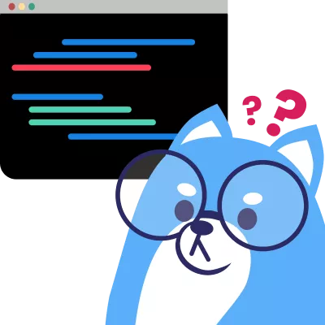

 

# Codey Bot

**The Discord Bot of University of Waterloo's Computer Science Club**

---

## Required config variables

Set these accordingly within the correct config folder. If you are testing locally, use the `/config/dev` folder for local configurations. By default, these variables should not be pushed to the remote.

- `TARGET_GUILD_ID`: the ID of the guild (server) in which coffee chats are being held.
- `COFFEE_ROLE_ID`: the ID of the role the bot will use to decide who is enrolled into coffee chats.
- `NOTIF_CHANNEL_ID`: the ID of the channel the bot will send system notifications to.
- `HONEYPOT_CHANNEL_ID`: the ID of the honeypot channel, used to help detect spammers and trolls.
- `ANNOUNCEMENTS_CHANNEL_ID`: the ID of the announcements channel.

## Required environment variables

Set these into your `.env` file. Make sure to not push these changes to git.

- `DISCORD_TOKEN`: the bot's token, found in the Discord Developer Portal. DO NOT REVEAL THIS TOKEN; ANYONE WITH THIS TOKEN CAN CONTROL YOUR BOT.

## Prerequisites

- [Yarn](https://classic.yarnpkg.com/en/docs/install)
- [Docker](https://docs.docker.com/get-docker/) (tested up to v20.10.6)

## Running the bot locally

1. Build docker image: `yarn image:build`
1. Start container in detached mode: `yarn start`
1. View and follow console output: `yarn logs`

## Other usage

- Stop the container: `yarn stop`
- Stop and remove the container: `yarn clean`
- Restart the container: `yarn restart`
- Fresh build and restart: `yarn image:build && yarn clean && yarn start`
