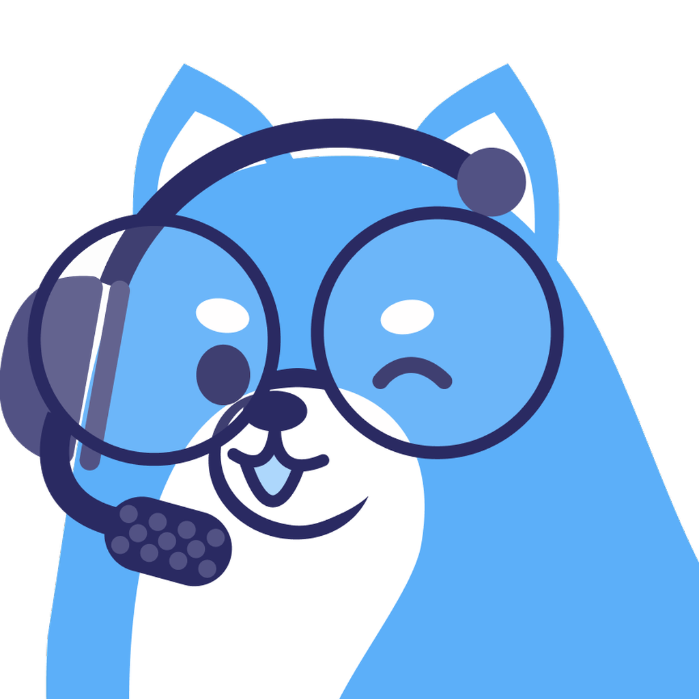
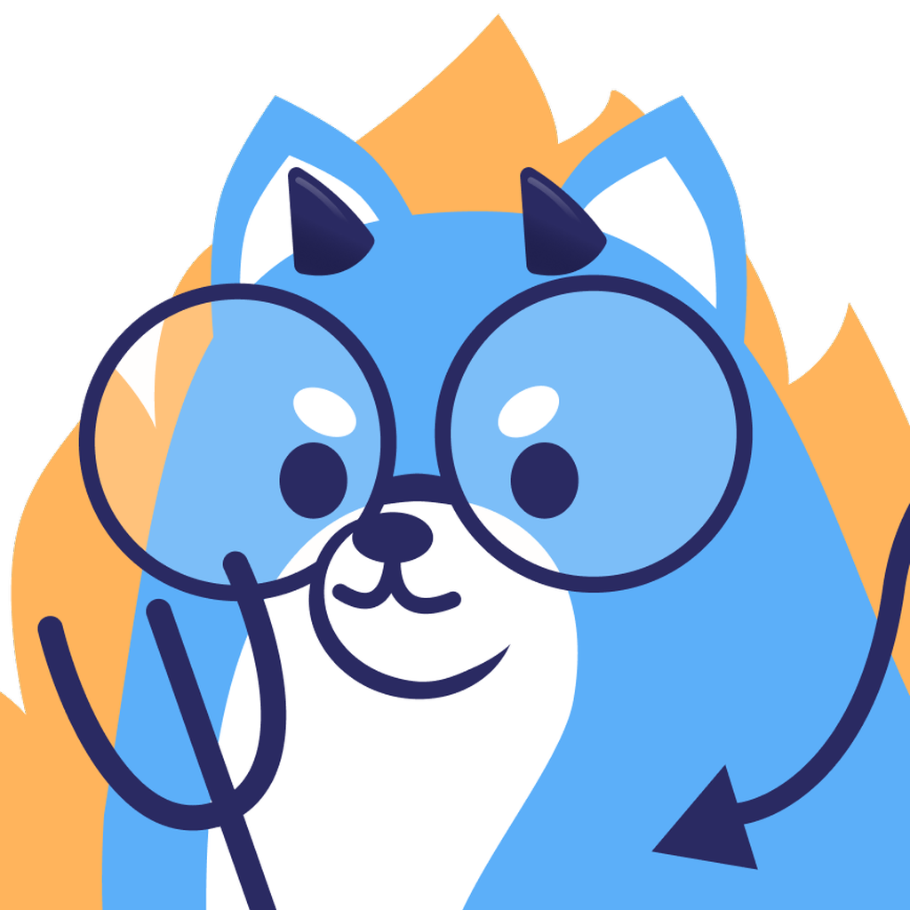

 

# Codey Bot

**The Discord Bot of University of Waterloo's Computer Science Club**

---

## Setup

You can follow the instructions outlined [in this document](docs/SETUP.md).

## Commands

### Docker

- Build the container: `yarn image:build`
- Start the container: `yarn start`
- Stop the container: `yarn stop`
- Stop and remove the container: `yarn clean`
- Restart the container: `yarn restart`
- Fresh build and restart: `yarn image:build && yarn clean && yarn start`

### Local

- Run the project: `yarn ts:build && yarn local:run`

### Miscellaneous

- Run linter: `yarn lint`
- Format code: `yarn format`

## Contributing

You can follow the steps [in this document](docs/CONTRIBUTING.md).

## License

All rights reserved for images.
