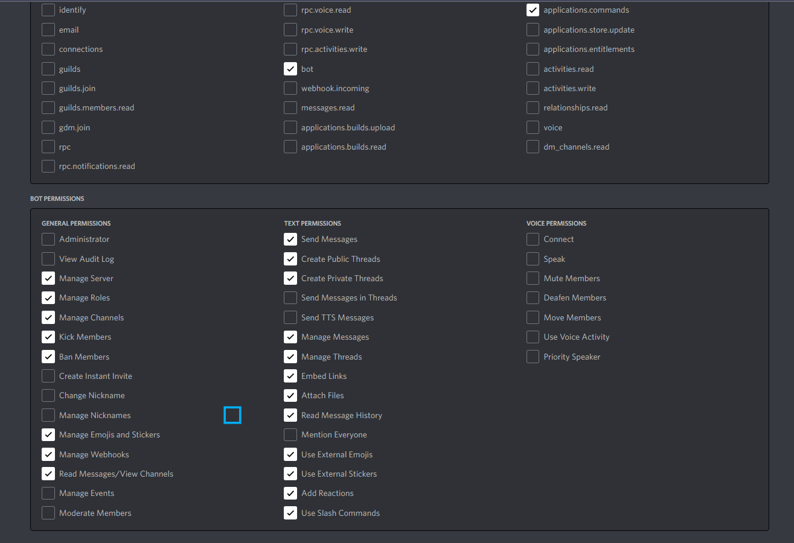

# Onboarding

This is mainly for external contributors.

## Setting up your development environment

1. Make sure you have Git, Yarn and Docker installed.

2. Fork the repository and clone it into the directory of your choice.

3. Set up your Discord testing server.

> For CodeyBot Developers, we have our own testing server - ask your team lead for more details

4. Set up your Discord testing bot for Codey, and add your bot to the Discord testing server. Make sure it has the following perms:



5. In your cloned project, create a `dev` folder in `config`, and create a `vars.json` file in it. Fill the JSON file with the corresponding values for each of the variables as described in the main README.md.

6. Make an `.env` file in the root folder of the project, and put your Discord bot's token. DO NOT REVEAL THIS: ANYONE WITH THIS HAS ACCESS TO YOUR BOT.

7. Run `yarn` in the root folder of your project to install all the dependencies required.

### Running the Bot using Docker

8. Run `yarn image:build` to create and build the Docker image for the bot.

9. If you run `docker image ls`, you should see `codey:latest` as one of the Docker images.

10. Next, run `yarn start` to start the bot. If this is run successfully, you should see a similar output to the following:
```
yarn run v1.22.18
$ docker-compose up -d
codey-bot is up-to-date
Done in 1.07s.
```
11. Run `yarn logs` to see the logs of the bot.

12. If everything is set up correctly, you should see your bot send a message in the configured notification channel (the channel assigned to `NOTIF_CHANNEL_ID` in your `vars.json`):

> Codey is up! App version: \<app version>

13. To stop the bot, run `yarn stop`.

### Running the bot locally

You can choose to run the bot locally instead of using Docker. This is helpful if Docker is not working as intended.

8. Install the dependencies `ghostscript` and `graphicsmagick` locally. This is required for the resume pdf->image converter functionality of Codey. 

For example, on Linux/Mac, you can do:
```
sudo apt install ghostscript
sudo apt install graphicsmagick
```

9. Run `yarn ts:build` to build the bot locally. If this run successfully, you should see a `dist` folder in your project, which contains all the compiled JS code.

10. Next, run `yarn local:run` to run the bot locally. Note that the logs are printed directly into the console output.

11. If everything is set up correctly, you should see your bot send a message in the configured notification channel (the channel assigned to `NOTIF_CHANNEL_ID` in your `vars.json`):

> Codey is up! App version: \<app version>

12. If you wish to stop the bot, just stop the command.

## Requesting features for the bot

We always welcome new feature requests for the bot :D

1. You can view all the current feature requests [here](https://github.com/uwcsc/codeybot/issues).

2. To request a new feature, click **New Issue**, and click the **Feature Request** template.

3. Fill in the details of your feature request.

## Making Features for the Bot

1. Before working on a feature, make an issue, as described in the previous section. We want to document what people are working on, and so we can avoid two people working on the same feature.

2. If you wish to work on the issue, ask one of the CodeyBot developers to assign you to the issue.

3. When you're done, make a PR from your branch to `master`.

4. Before your PR can be merged, you need to pass the pipeline. Often, one of the most common reasons why the pipeline fails is because the linter fails. To solve this, you can run `yarn lint` to see any linting issues you might have, or `yarn format` to automatically fix any linting issues in your code.
