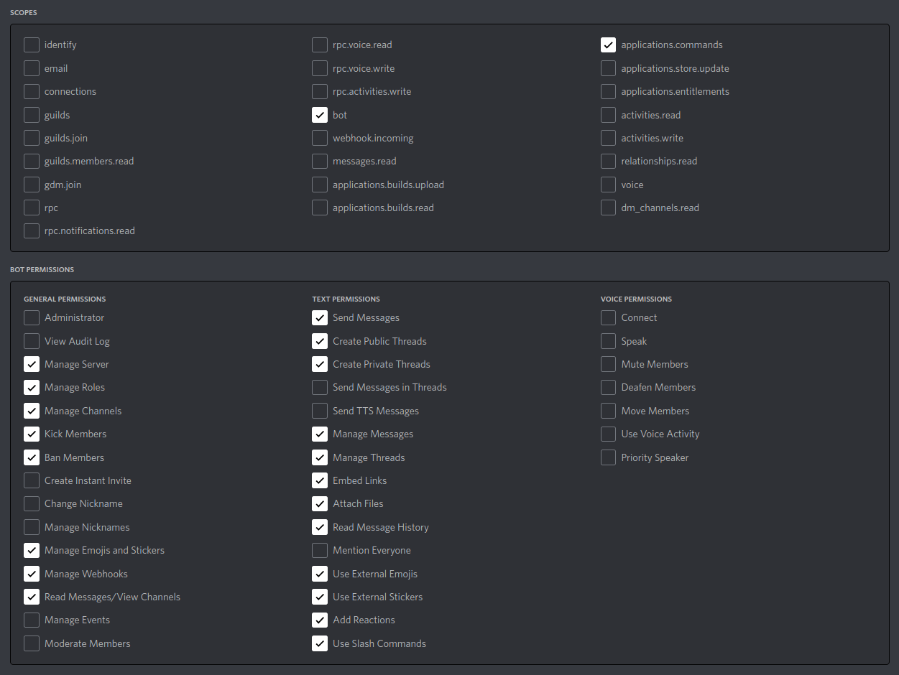

# Setting up the bot locally

1. Make sure you have the following prerequisites installed:
  - Git
  - [Yarn](https://classic.yarnpkg.com/en/docs/install)
  - [Docker](https://docs.docker.com/get-docker/)

2. Fork the repository and clone it into the directory of your choice.

> This is not necessary for CodeyBot developers - you can work directly from the main repository.

3. Set up your Discord testing server.

> For CodeyBot developers, we have our own dedicated testing server - ask your team lead for more details.

4. Set up your Discord testing bot for Codey, and add your bot to the Discord testing server. Make sure it has the following perms:



5. In your cloned project, create a `dev` folder in `config`, and create a `vars.json` file in it. Fill the JSON file with the corresponding values for each of the variables as described in the main README.md.

6. Make an `.env` file in the root folder of the project, and put your Discord bot's token:
```
DISCORD_TOKEN=<insert token here>
```
DO NOT REVEAL THIS: ANYONE WITH THIS HAS ACCESS TO YOUR BOT.

7. Run `yarn` in the root folder of your project to install all the dependencies required.

### Running the bot using Docker

8. Run `yarn image:build` to create and build the Docker image for the bot.

9. If you run `docker image ls`, you should see `codey:latest` as one of the Docker images.

10. Next, run `yarn start` to start the bot. If this is run successfully, you should see a similar output to the following:
```
yarn run v1.22.18
$ docker-compose up -d
codey-bot is up-to-date
Done in 1.07s.
```
11. Run `yarn logs` to see the logs of the bot.

12. If everything is set up correctly, you should see your bot send a message in the configured notification channel (the channel assigned to `NOTIF_CHANNEL_ID` in your `vars.json`):

> Codey is up! App version: \<app version>

13. To stop the bot, run `yarn stop`. To stop the bot and remove the container, run `yarn clean`.

### Running the bot locally

You can choose to run the bot locally instead of using Docker. This is helpful if Docker is not working as intended.

8. Install the dependencies `ghostscript` and `graphicsmagick` locally. This is required for the resume pdf->image converter functionality of Codey. 

For example, on Mac and some Linux distros, you can do:
```
sudo apt install ghostscript
sudo apt install graphicsmagick
```

9. Run `yarn ts:build` to build the bot locally. If this run successfully, you should see a `dist` folder in your project, which contains all the compiled JS code.

10. Next, run `yarn local:run` to run the bot locally. Note that the logs are printed directly into the console output.

11. If everything is set up correctly, you should see your bot send a message in the configured notification channel (the channel assigned to `NOTIF_CHANNEL_ID` in your `vars.json`):

> Codey is up! App version: \<app version>

12. If you wish to stop the bot, just stop the command.
